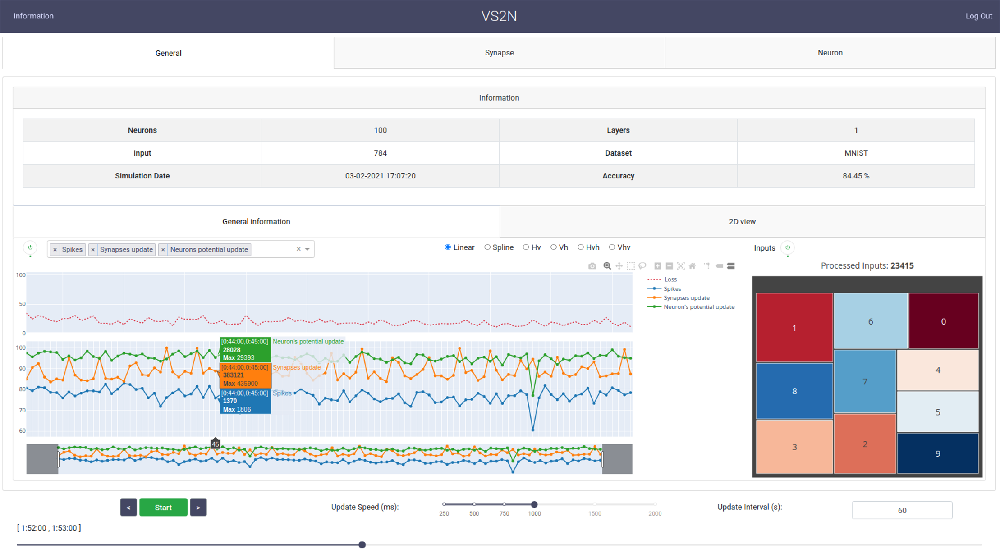

> Please refer to the [main Gitlab repository](https://gitlab.univ-lille.fr/bioinsp/VS2N) for source code and more details


VS2N (**V**isualization tool for **S**piking **N**eural **N**etworks) is an interactive web-based tool. It is designed to analyze and visualize the activity we collect from SNN simulators.

We can use VS2N to:
- Follow the evolution of our network during training.
- Validate hypotheses.
- Debug any newly implemented component.

VS2N is a module-based tool written in Python, those modules concern
defined questions or elements to visualize, and it is possible to add
new modules. Each module contains different visualizations.

Initial requirements for contributions :
- Python (Flask)
- Dash Plotly (to implement different visualizations)
- Apache Spark (for any heavy pre-calculations if needed)
- MongoDB (to store and read data)

--------



## Documentation

https://gitlab.univ-lille.fr/bioinsp/VS2N/-/wikis/home

# Installation

### 1- Install MongoDB

Use the following [link](https://docs.mongodb.com/manual/administration/install-community/) to install MongoDB.

### 2- Install Apache Spark and other dependencies

Execute this command to install the needed libraries

```console
pip install -r requirements.txt
```

## Execution

1. If you want to add authentication to VS2N (optional):

- Generate users credentials (Email/Password) using `python manageUsers.py`

2. Rename `default.config.py` to `config.py`

3. If a password protects MongoDB:

- Add MongoDB credentials in `config.py`


4. Using Python >= 3.0 (**make sure MongoDB is running**) run `python VS2N.py` to start VS2N. If everything is fine, the web interface should appear automatically.

## Docker image
You can also use a docker image to run VS2N : https://hub.docker.com/r/helbez/vs2n

## Folder structure

```
VS2N.py             # Main script to start VS2N.
addUser.py          # Generate user credentials.
defaut.config.py    # Default configuration file.
img/                # Folder contains images.
Docker/             # Contains docker files.
assets/             # Folder contains CSS file.
src/                # Source directory.
|- Modules/         # Folder of the existing modules.
|- static/          # Contains static files (.js, .css, etc).
|- templates/       # Static html files + template for new modules.
|- Global_Var.py    # Contains global variables of VS2N.
```

# [Changes Log](https://gitlab.univ-lille.fr/bioinsp/VS2N/-/blob/master/CHANGELOG.md)

## v0.36	

### Core
- Multilayer support added
- Spark & MongoDB version updated

## v0.35	

### Core
- Graphs improved & fixed typos.
- UI updated.

## v0.34	

### Core
- Added authentication.
- Added support for Nengo simulator.

View the full changes log [here](https://gitlab.univ-lille.fr/bioinsp/VS2N/-/blob/master/CHANGELOG.md)

# Citation

In case you decide to mention or use VS2N:

> H. Elbez, M. K. Benhaoua, P. Devienne and P. Boulet, "VS2N : Interactive Dynamic Visualization and Analysis Tool for Spiking Neural Networks," 2021 International Conference on Content-Based Multimedia Indexing (CBMI), pp. 1-6, 2021.
# License

The project is licensed under the [CeCILL-B](https://gitlab.univ-lille.fr/bioinsp/VS2N/-/blob/master/LICENSE) license.
